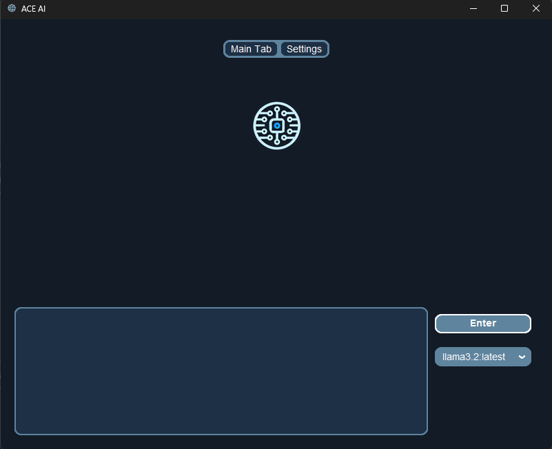
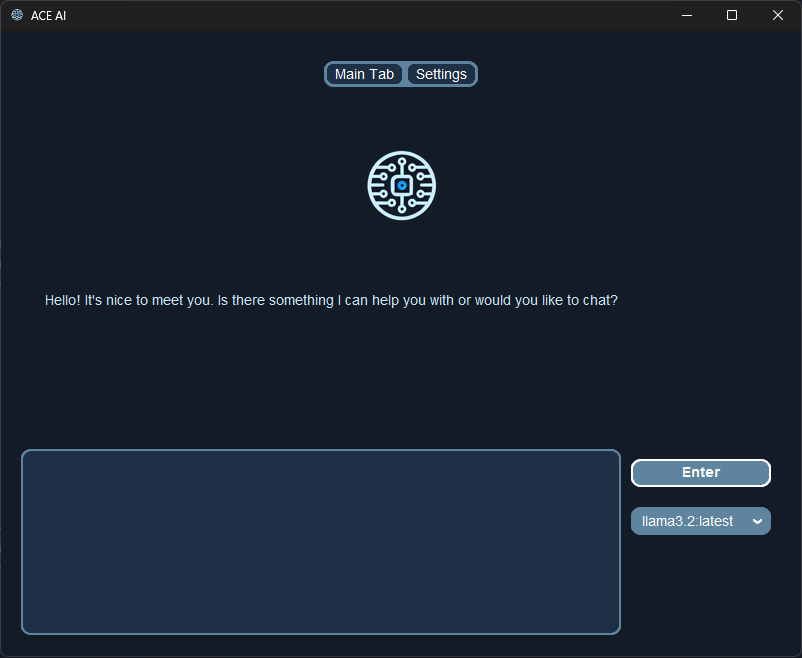
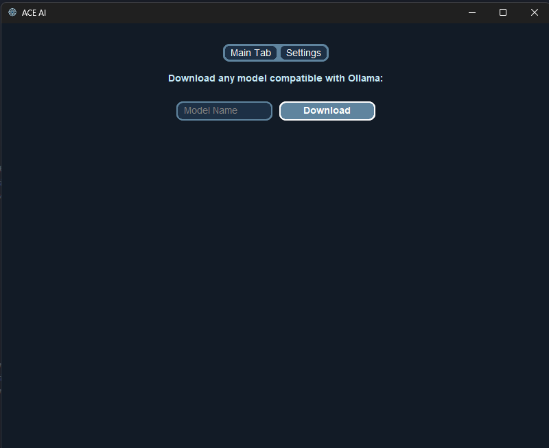

# ACE (Ollama GUI for Windows)

## Overview

**ACE** is a graphical user interface (GUI) for **Ollama**, designed to eliminate the need for command-line usage. This project provides an intuitive interface for users to interact with locally installed AI models.

## Features

- **Model Selection**: Easily switch between installed AI models.
- **Install New Models**: Enter the name of any model that is compatible with Ollama in the settings tab and install it without the need for the terminal.
- **Memory from previous chats in a session**: It has the capability to remember things you ask it during your session and chat.
- **Local Execution**: Run models directly on your machine without an internet connection.
- **Real-time Output**: Experience word-by-word output rendering for a natural, real-time effect.
- **PDF Processing**: Upload and analyze PDFs.

## Planned Features

- **Shows Previous Messages and Responses**
- **Image Processing**: Upload and analyze images.
- **Prompt Modes**: Creating modes for studying, etc so a prompt is always added before your message such as "explain as though I am five years old".

## Installation

### Requirements

- Python **3.8** or later
- `pip` package manager
- Ollama Python API/Library using `pip install ollama`

### Current Ollama Requirements

Currently, you must install Ollama manually from [Ollama's official website](https://ollama.com) and install models using the command prompt. A future update will allow users to install models directly from the UI if an internet connection is present.

### Steps

1. Clone the repository:
   ```sh
   git clone https://github.com/m-jay21/ACE-Ollama-GUI.git
   ```

2. Run the application:
   ```sh
   python ui.py
   ```

## Images





## Usage

1. Launch the GUI.
2. Select an installed model or install a new model.
3. Enter prompts and receive real-time responses.

## Contributing

Contributions are welcome! To contribute:

1. Fork the repository.
2. Create a new branch for your feature/fix.
3. Commit and push your changes.
4. Submit a pull request.

## Issues

If you encounter any issues, feel free to open an issue on GitHub.

## License

This project is licensed under the **MIT License**.

## Need Help?

Reach out through **GitHub Discussions**.
